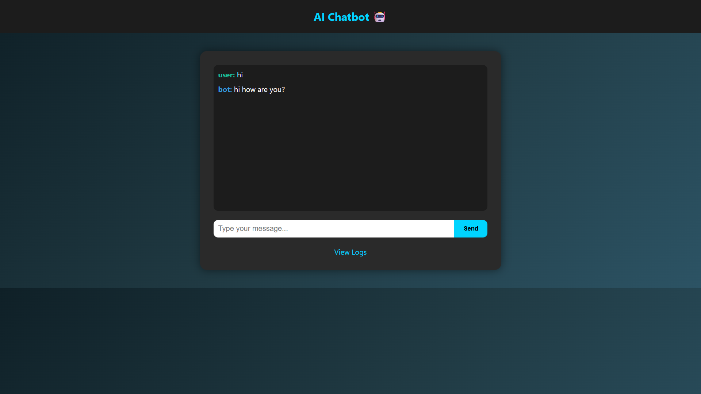
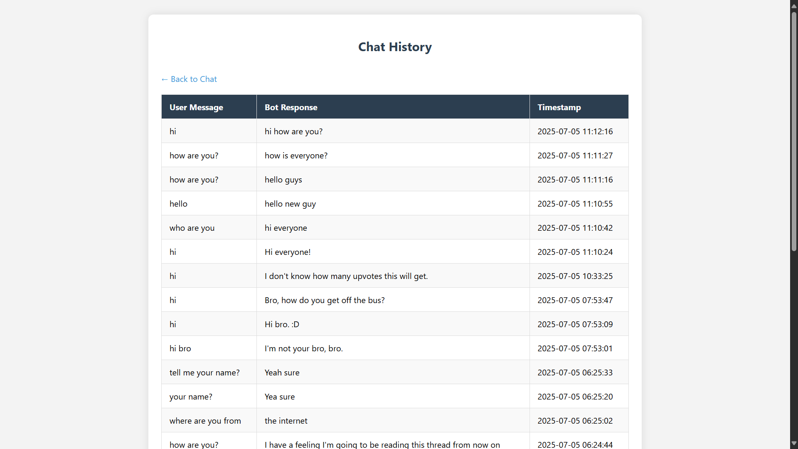

# 🤖 AI Chatbot with Memory (Flask + Transformers)

A simple yet powerful AI-powered chatbot built with **Flask** and **HuggingFace Transformers**, capable of human-like conversation. It stores chat history in **SQLite** and provides a web-based UI to interact and review logs.

---

## 🌐 Live Preview

> Currently running on **localhost**. Deployment option paused.  
> ⚙️ To run locally, follow the setup guide below.

---

## 📸 Screenshots

| Chatbot Interface | Chat Logs |
|------------------|-----------|
|  |  |

---

## 🧠 Features

- ✅ Natural Language Understanding using `DialoGPT`
- ✅ Simple and responsive web UI (HTML + CSS + JS)
- ✅ Stores chat history in `SQLite`
- ✅ View chat logs at `/logs`
- ✅ API-based design using Flask
- ✅ Easy to run locally using `venv`

---

## 🛠️ Tech Stack

- **Frontend:** HTML, CSS, JavaScript (AJAX)
- **Backend:** Python + Flask
- **AI Model:** HuggingFace Transformers (`DialoGPT`)
- **Database:** SQLite (via `sqlite3`)
- **Other Libraries:** `torch`, `transformers`, `nltk`, `gunicorn` (optional)

---

## 🚀 Getting Started

To clone and run this project locally:

```bash
# 1. Clone the repo
git clone https://github.com/Kapil-Saikia/ai_chatbot_project.git
cd ai_chatbot_project

# 2. Create a virtual environment
python -m venv venv

# 3. Activate the environment
# On Windows:
venv\Scripts\activate
# On macOS/Linux:
source venv/bin/activate

# 4. Install dependencies
pip install -r requirements.txt

# 5. Run the chatbot
python app.py

```


---

## 🙋‍♂️ Author

**Kapil Saikia**  
B.Tech CSE – 4th Year Student  
🔗 [GitHub Profile](https://github.com/Kapil-Saikia)
